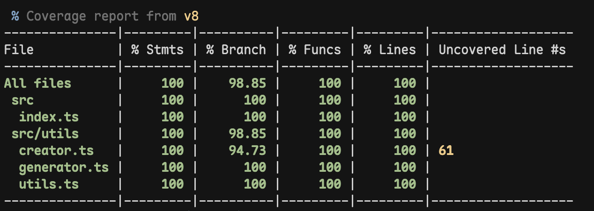

# @siyuan0215/easier-axios-dsl

基于 [Axios](https://www.npmjs.com/package/axios) 以及借鉴了简单的 DSL（领域特定语言）制定了一套基本规则用于接口对接，减少冗余、重复的接口声明模板代码，提高开发效率。

## 🤖 如何安装？

使用 NPM 安装：

```bash
npm i @siyuan0215/easier-axios-dsl
```

使用 Yarn 安装：

```bash
yarn add @siyuan0215/easier-axios-dsl
```

## 🤙 优势

未使用 easier-axios-dsl 之前，对接接口的时候往往需要添加如下代码：

```ts
// api/index.ts
import { request } from "@/utils/request";

export const getUserInfo = (userId: string) =>
  request("api/getUserInfo", {
    method: "GET",
    params: { userId },
  });

export const getPosts = ({ pageNumber, pageSize }) =>
  request("api/getPosts", {
    method: "GET",
    params: {
      pageNumber,
      pageSize,
    },
  });

export const saveUserInfo = (userInfo: UserInfo) =>
  request("api/saveUserInfo", {
    method: "POST",
    data: userInfo,
  });
```

可以看出，在声明接口时有很多重复的模板代码，这种方式主要有两个痛点：

- 接口较多时，大量的模板代码导致的冗余的代码增加，前端资源体积会增大；
- 影响了开发小伙伴的开发效率；

easier-axios-dsl 利用简单的“特定领域语言”优化了上述的两个痛点，一定程度上提高了开发的效率和减少了冗余的代码。

对于上述的代码例子，使用 easier-axios-dsl 进行改造：

```ts
// api/index.ts
import { generatorAPIS } from "@/utils/generateAPIs";

enum APIS {
  getUserInfo = "GET api/getUserInfo q:userId",
  getPosts = "GET api/getPosts d:pageNumber,pageSize",
  saveUserInfo = "POST api/saveUserInfo d:*",
}

export default generatorAPIS<typeof APIS>(APIS);
```

可以明显看出，使用 easier-axios-dsl 对接接口时 coding 更顺畅也更简洁。

此外，还提供了智能的请求头处理机制，自动处理Content-Type设置，支持FormData转换，让文件上传等场景更加便捷。

_默认导出的 `generatorAPIS<typeof APIS>(APIS);` 函数执行结果是对象。_

需要注意的是，接口对象是以我们**声明的接口的名字**作为 key（比如 `getUserInfo`），以 `Promise` 作为值。因此我们既可以使用 `async / await` 也可以使用 `Promise` 处理请求的回调。

## ⚙️ 如何静态（全局）配置？

easier-axios-dsl 基于 Axios 进行二次封装。

考虑到可扩展性，我们提供了 `requestCreator(options: AxiosRequestConfig & Options<T>)` 方法需要您自行创建一个 Axios 的实例，并允许我们对其进行静态地配置。

```ts
// utils/generateAPIs.ts

import { requestCreator, G } from "@siyuan0215/easier-axios-dsl";

const otherAxiosConfig = {
  timeout: TIMEOUT.DEFAULT,
  withCredentials: true,
};

// 创建一个 Axios 的实例，参数为静态配置
export const request = requestCreator({
  requestInterceptors: [
    /* ... */
  ],
  responseInterceptors: [
    /* ... */
  ],
  ...otherAxiosConfig,
});

// 当前版本下，此具名导出必不可少
export const generatorAPIS = <T extends {}>(apiConfig: T) =>
  G<T>(request, apiConfig);
```

_❗️ 请注意，看上去上述代码有些繁琐，本可以将静态配置传入 `G` 函数中，直接返回 `generatorAPIS` 函数即可。但是考虑到在项目中可能有些接口对接需要用到 Axios 实例，因此我们决定将其暴露出来。_

`requestCreator` 函数返回的请求实例 `request` 函数参数类型声明如下：

```ts
request(
  { method, url, params, ...restOptions }: {
      url: AxiosRequestConfig["url"];
      method: AxiosRequestConfig["method"];
      params: AxiosRequestConfig["params"] | AxiosRequestConfig["data"];
    } & Omit<AxiosRequestConfig<any>, "url" | "method" | "params" | "data">,
  // 是否将 body 体封装为 formData
  isFormData?: boolean | undefined): Promise<T>
```

`request` 函数中接收传递请求体数据的 key 是 `params`，不论是 `POST` 还是 `GET` 请求方式，均通过这个字段传递。

我们保（tou）留（lan）了 Axios 的配置，同时提供了如下配置项：

```ts
export type Options<T> = {
  // 请求拦截器
  requestInterceptors: [OnFulfilled<AxiosRequestConfig>, OnRejected];
  // 响应拦截器
  responseInterceptors: [OnFulfilled<AxiosResponse<T>>, OnRejected];
};
```

| 参数                   | 类型                                            | 是否必填 | 说明       |
| ---------------------- | ----------------------------------------------- | -------- | ---------- |
| `requestInterceptors`  | `[OnFulfilled<AxiosRequestConfig>, OnRejected]` | 否       | 请求拦截器 |
| `responseInterceptors` | `[OnFulfilled<AxiosResponse>,OnRejected]`       | 否       | 响应拦截器 |

拦截器的具体配置方法参照[官方文档](https://axios-http.com/docs/interceptors)。

_❗️ 需要注意的是，使用 `requestCreator` 创建后的 Axios 实例会丢失官方的请求拦截和响应拦截的**静态**配置方式，需要使用 `requestInterceptors` 和 `responseInterceptors` 配置项，同时也无法使用多拦截器的特性。_

### 请求头处理机制

`requestCreator` 创建的请求实例具有智能的请求头处理机制：

- **默认Content-Type**：自动设置 `application/json`
- **FormData支持**：当 `isFormData` 参数为 `true` 时，自动设置 `multipart/form-data`
- **自定义覆盖**：如果传入的headers中包含Content-Type，会优先使用自定义值
- **智能合并**：其他自定义headers会与默认headers正确合并

```ts
// 示例：智能请求头处理
const request = requestCreator({
  requestInterceptors: [],
  responseInterceptors: [],
});

// 1. 默认JSON请求
await request({
  url: '/api/users',
  method: 'POST',
  params: { name: 'John' }
});
// Content-Type: application/json

// 2. FormData请求
await request({
  url: '/api/upload',
  method: 'POST',
  params: { file: fileData }
}, true);
// Content-Type: multipart/form-data

// 3. 自定义Content-Type
await request({
  url: '/api/export',
  method: 'POST',
  params: { data: exportData },
  headers: { 'Content-Type': 'application/xml' }
});
// Content-Type: application/xml (自定义值优先)
```

## 🧑🏽‍💻 如何使用？

继续以上述改造后的接口声明文件为例，我们创建了如下三个接口的函数（服务）：

- `getUserInfo`；
- `getPosts`；
- `saveUserInfo`；

只需要我们在对应的业务组件中，引入我们的接口函数，调用即可。

```HTML
<script lang="ts">
import APIS from '@/api/index.ts';

const fetchUserInfo = async (userId: string) => {
  try {
    const { data } = await APIS.getUserInfo({ userId });
    // ...
  } catch(error) {
    console.log("getUserInfo =>", error)
  }
}

// 文件上传示例
const uploadFile = async (file: File, description: string) => {
  try {
    const result = await APIS.uploadFile(
      { file, description },
      undefined, // otherPayload
      { 
        headers: { 'Authorization': 'Bearer token' },
        onUploadProgress: (progressEvent) => {
          console.log('Upload progress:', progressEvent.loaded / progressEvent.total * 100);
        }
      }
    );
    return result;
  } catch(error) {
    console.log("uploadFile =>", error)
  }
}
</script>
```

接口函数中的类型如下：

```ts
type ApiRequestUrlMethod = (
  majorPayload: Record<string, any> | any[],
  otherPayload?: Record<string, any>,
  AxiosConfig?: AxiosRequestConfig
) => Promise;
```

其中：

- `majorPayload`：既可以是对象，也可以是数组（取决于后端声明 `POST` 请求的 body 体类型）;
- `otherPayload`：对象，可选，仅当 body 体需要传递数组，且接口仍需要传递额外的参数时，将额外的参数传入此对象中；
- `AxiosConfig`：对象，可选，Axios 运行时配置；

_❗️ 如果需要给请求添加运行时配置 `AxiosConfig`，又不需要用到 `otherPayload`（body 体非数组），请将第二个参数显示地传入 `undefined` 或 `void 0`，例如：_

```ts
APIS.exportFile(params, undefined, { responseType: "blob" });
// or
APIS.exportFile(params, void 0, { responseType: "blob" });
```

## 🔌 语法规则详解

### 基本格式
```
[HTTP方法] [URL] [参数载体类型]:[参数列表]
```

### 语法组成部分

| 组成部分 | 说明 | 示例 |
|---------|------|------|
| **HTTP方法** | 请求方式 | `GET`、`POST`、`PUT`、`DELETE` |
| **URL** | 请求地址 | `api/users/profile` |
| **参数载体类型** | 参数传递方式 | `d:name,age`、`q:page,size`、`path:id` |
| **参数列表** | 具体参数名 | `id,name,gender` 或 `*` |

### 参数载体类型详解

| 载体类型 | 适用请求 | 说明 | 示例 |
|---------|---------|------|------|
| `d` 或 `data` | POST/PUT | 普通对象参数，放入请求体 | `d:name,age` |
| `d.f` 或 `data.formData` | POST/PUT | FormData类型，对象自动转换 | `d.f:file,description` |
| `[d]` 或 `[data]` | POST/PUT | 数组参数 | `[d]` |
| `q` 或 `query` | GET/DELETE | URL查询参数 | `q:page,size` |
| `path` | 所有请求 | 动态路由参数 | `path:userId` |

### 参数列表模式

| 模式 | 语法 | 说明 | 示例 |
|------|------|------|------|
| **枚举模式** | `param1,param2,param3` | 明确指定参数名（逗号分隔，无空格） | `id,name,gender` |
| **通配符模式** | `*` | 传递所有参数（跳过校验） | `*` |

### 注意事项

- 参数载体类型可多个，但不能重复
- 载体类型和参数列表必须用冒号 `:` 连接，中间不能有空格
- 枚举模式的参数名用逗号分隔，不能有空格
- 通配符模式会跳过参数校验，传递所有传入的参数
- 请求头处理遵循优先级：自定义Content-Type > FormData自动设置 > 默认JSON类型

### 使用示例

#### POST 请求示例

- **`POST posts/save d:*`** - 保存文章，传递所有参数
  ```ts
  api.post({ url: 'posts/save', data: params })
  ```

- **`POST upload-file d:sourceType,systemType,fileName,file,remark`** - 文件上传，指定参数
  ```ts
  api.post({ url: 'upload-file', data: { fileName, file, remark } })
  ```

- **`POST posts/list q:pageNumber,pageSize`** - 获取文章列表，查询参数
  ```ts
  api.post({ url: 'posts/list', params: { pageNumber, pageSize } })
  ```

- **`POST users/search [d] q:a`** - 用户搜索，数组参数 + 查询参数
  ```ts
  api.post({ url: 'users/search?a=1', data: searchData })
  ```

- **`POST users/update d.f:a,b,c`** - 用户更新，FormData 格式
  ```ts
  api.post({ url: 'users/update', data: FormData, headers: { 'Content-Type': 'multipart/form-data' } })
  ```

- **`POST api/upload d:file`** - 文件上传，自定义请求头
  ```ts
  // 自动处理Content-Type，支持自定义headers
  api.post({ 
    url: 'api/upload', 
    data: fileData,
    headers: { 
      'Authorization': 'Bearer token',
      'X-Custom-Header': 'value'
    }
  }, true) // isFormData = true
  ```

#### GET 请求示例

- **`GET users/getUserInfo q:userId`** - 获取用户信息，查询参数
  ```ts
  api.get({ url: 'users/getUserInfo', params: { userId } })
  ```

- **`GET users/get/{id} path:id`** - 获取用户，路径参数
  ```ts
  api.get({ url: 'users/get/' + id })
  ```

## 👻 单元测试

尽可能的覆盖所有的代码，保证代码的质量。我们为所有核心功能提供了全面的单元测试：

### 测试覆盖范围

- ✅ **基本功能测试** - 请求实例创建、配置选项
- ✅ **拦截器测试** - 请求/响应拦截器设置
- ✅ **HTTP方法测试** - GET、POST、PUT、DELETE请求处理
- ✅ **FormData处理测试** - 文件上传、数据转换
- ✅ **请求头处理测试** - Content-Type自动设置、自定义headers
- ✅ **运行时配置测试** - 动态配置选项传递
- ✅ **错误处理测试** - 异常情况处理
- ✅ **边界情况测试** - 空参数、复杂对象等边界场景

### 测试覆盖率



所有核心功能都有完整的测试覆盖，确保代码的可靠性和稳定性。

## 📦 版本更新

### 最新改进

- ✅ **智能请求头处理** - 优化Content-Type设置逻辑，支持自定义覆盖
- ✅ **完善的单元测试** - 新增21个测试用例，覆盖所有核心功能
- ✅ **FormData支持增强** - 改进FormData转换和Content-Type处理

### 未来计划

- [X] 单元测试的编写；
- [X] 智能请求头处理机制；
- [ ] 支持多拦截器；
- [ ] 支持更多的载体类型，比如 Map 等；
- [ ] 支持原生小程序；
